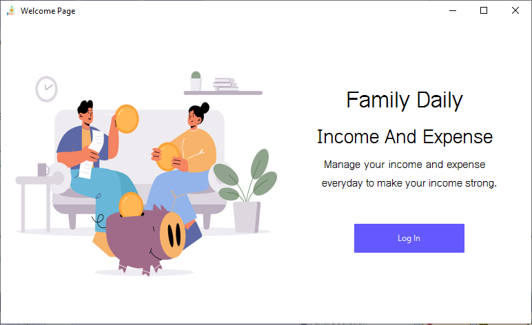
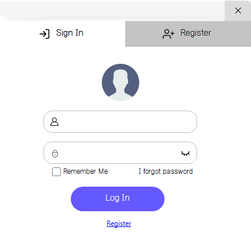
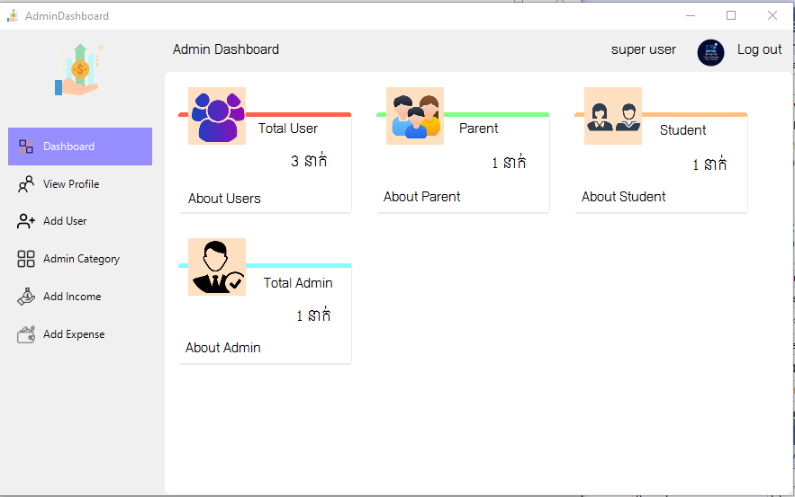
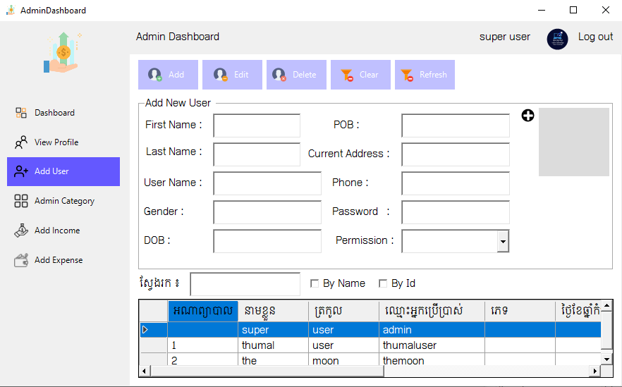

<h1 align="center">Income_and_expense_using_vb.net</h1>

# Income_and_expense_using_vb.net

## To run this project

git clone https://github.com/thasocheat/Family_daily_income_and_expense_using_vb.net/tree/main

1. Open the wamserver or xampp

2. Create database

3. locate in to project directory name MySQL Database and click open the sql file and run query

## User and Password
  - admin
  - 123

## Demo
<h5 align="center">Welcome Page</h5>

<h5 align="center">Login page</h5>

<h5 align="center">Dashboard</h5>

<h5 align="center">Add new user page</h5>

## Me do this just for learn👩‍💻👨‍💻 :

  

